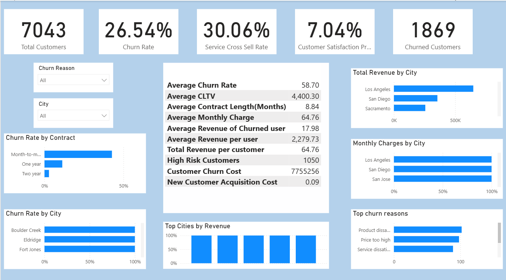

# 📉 Telco Customer Churn Analysis

> End-to-end Power BI dashboard analyzing churn drivers, customer lifetime value (CLTV), and revenue impact across 7,000+ telecom customers translating raw data into retention strategy.

---

## 📌 Overview

Customer churn is one of the most expensive problems in the telecom industry acquiring a new customer costs 5–25x more than retaining an existing one. This project builds a business intelligence solution that goes beyond simply measuring churn: it quantifies the financial impact, identifies the specific customer segments driving it, and surfaces actionable retention signals through an interactive Power BI dashboard.

---

## 🖼️ Dashboard Preview



---

## 📊 Key Findings

| Metric | Value |
|---|---|
| Total Customers Analysed | **7,043** |
| Overall Churn Rate | **26.54%** |
| Estimated Revenue at Risk | **$7.75M** |

**Top churn drivers identified:**
- Month-to-month contract customers churn at significantly higher rates than annual/two-year contract customers
- Fiber optic internet service customers show elevated churn despite higher spend
- Customers in early tenure (< 12 months) represent the highest churn risk segment
- Electronic check payment method correlates with above-average churn rates

---

## 📋 Dashboard Features

- **Executive Summary** — overall churn rate, revenue at risk, and customer count KPIs at a glance
- **Churn Driver Analysis** — breakdown by contract type, internet service, payment method, and tenure band
- **CLTV Segmentation** — customer lifetime value analysis to prioritise retention spend on high-value at-risk customers
- **Demographic Cuts** — churn patterns by senior citizen status, partner/dependent status
- **Revenue Impact** — churned revenue vs. retained revenue comparison with trend context

---

## 🛠️ Technical Approach

**Data Preparation (Power Query):**
- Handled missing values in `TotalCharges` column
- Standardised categorical fields (Yes/No encoding, service type normalisation)
- Created tenure bands for cohort analysis (< 1 year, 1–2 years, 2+ years)
- Built star schema data model for efficient cross-filtering and DAX performance

**DAX Measures (sample):**
```dax
Churn Rate = DIVIDE([Churned Customers], [Total Customers])

Revenue at Risk = 
CALCULATE(
    SUM(Telco[MonthlyCharges]),
    Telco[Churn] = "Yes"
) * 12

CLTV = DIVIDE(SUM(Telco[MonthlyCharges]), [Churn Rate])
```

---

## 📁 Dataset

**IBM Telco Customer Churn Dataset** — included in this repo as `churn_data.xlsx`
- 7,043 rows · 21 features
- Features: demographics, subscribed services, contract details, billing method, tenure, monthly charges, total charges, churn label

---

## ⚙️ Setup & Usage

1. Clone or download this repo — the dataset (`churn_data.xlsx`) and dashboard (`*.pbix`) are both included, no external download needed
2. Open the `.pbix` file in **Power BI Desktop** (free download from Microsoft)
3. If prompted, update the data source path to point to `churn_data.xlsx` in the repo folder
4. Interact with slicers to filter by contract type, internet service, tenure band, or demographic segment

---

## 🔍 Limitations & Future Work

- **Predictive layer**: Current dashboard is descriptive — adding a Python/ML churn prediction model (logistic regression or XGBoost) would enable proactive identification of at-risk customers
- **Real-time data**: Connecting to a live CRM data source would shift this from a static analysis to an operational retention tool
- **Cohort tracking**: Adding month-over-month churn trend analysis would surface whether retention is improving over time

---

## 🛠️ Tech Stack


---

## 📄 License

This project is open-source under the [MIT License](LICENSE).
